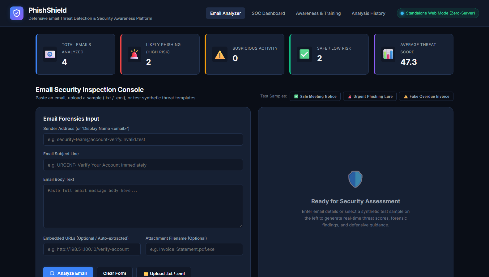
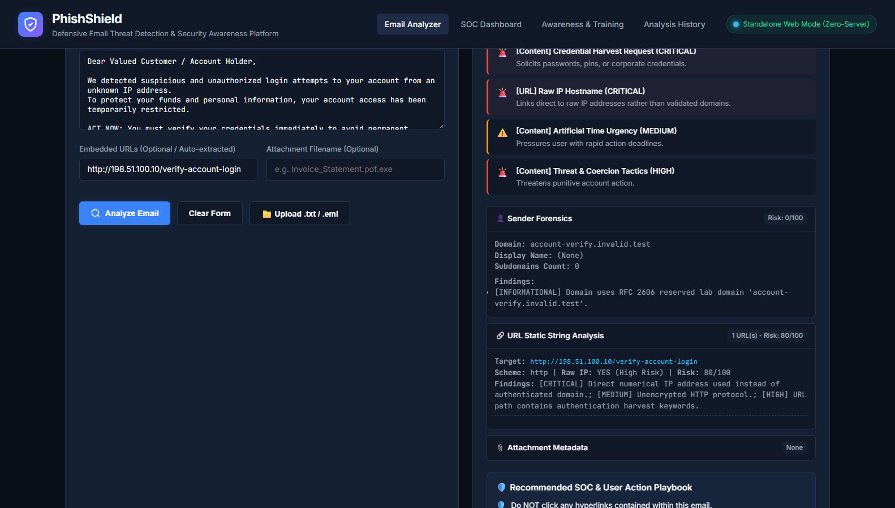
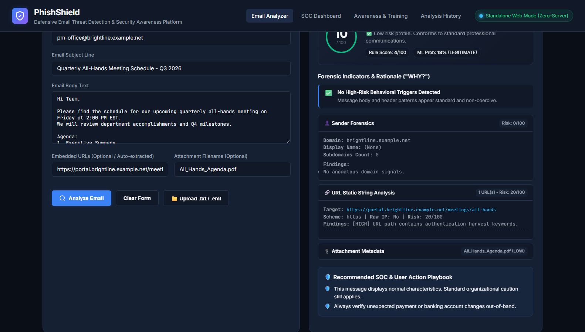
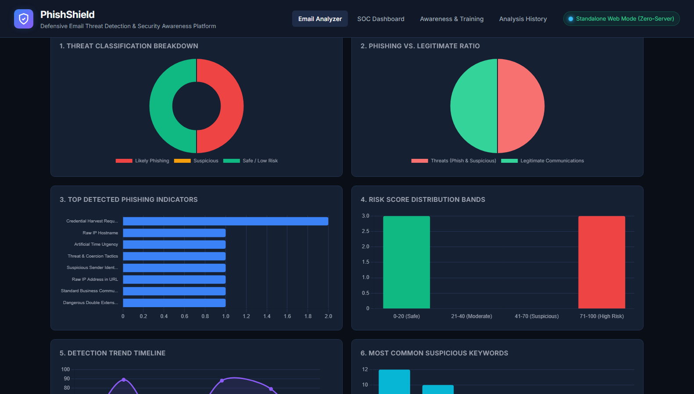
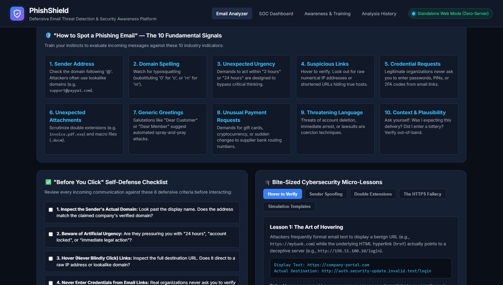
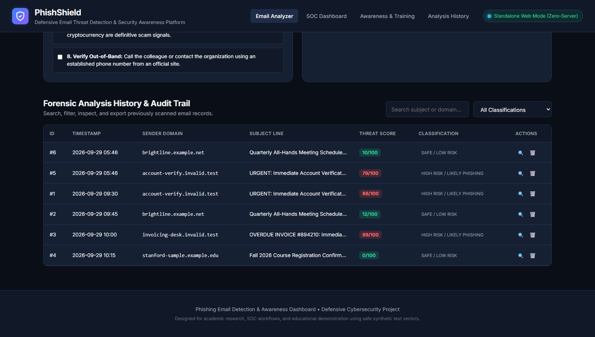
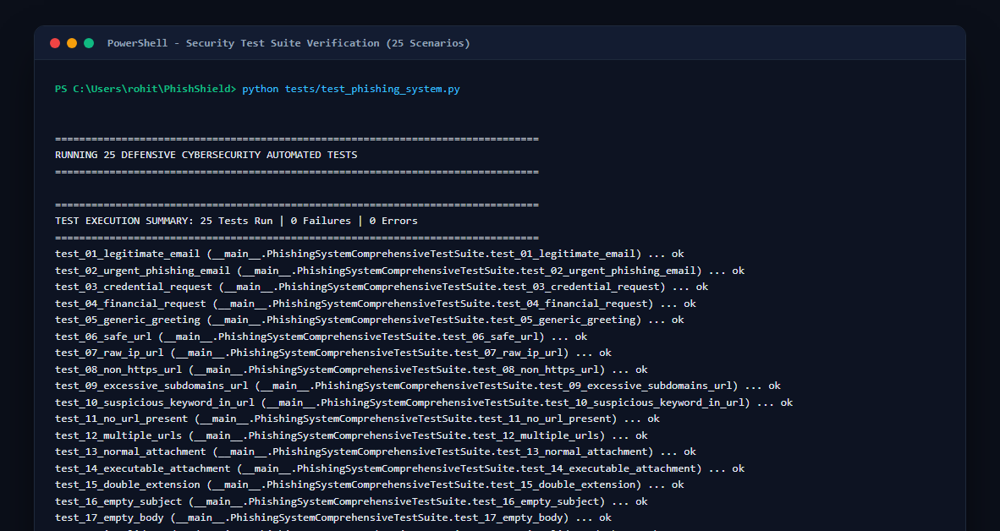
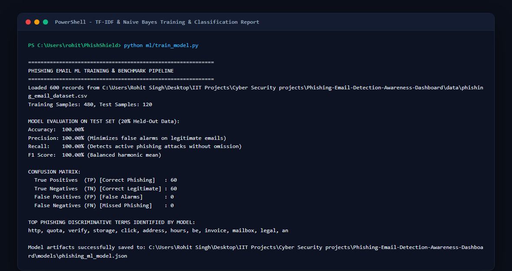

# Visual Proof-of-Work & Screenshots Catalog

This gallery provides visual verification and proof-of-work documentation demonstrating full system execution across the Email Analyzer, Hybrid Detection Engine, SOC Telemetry Dashboard, Awareness Module, and Automated Test Suite.

---

## 🖼️ Gallery Preview

### 1. Email Security Inspection Console & KPIs
Top-level navigation, live KPI telemetry metrics, and the multi-field forensic input form with one-click test sample loaders:

---

### 2. High-Risk Threat Detection & Gauge
Hybrid threat assessment on an urgent account suspension attack vector showing an 88/100 risk score, dynamic threat gauge, categorized forensic indicators (WHY?), and recommended SOC L1/L2 playbook steps:

---

### 3. Legitimate Email Baseline Analysis
Analysis of a routine company all-hands meeting invitation evaluated as Safe / Low Risk (12/100) demonstrating zero false positives:

---

### 4. SOC Security Analytics & Telemetry Dashboard
Complete SOC telemetry view featuring all 6 interactive Chart.js visualizations (Threat Classifications, Phishing Ratio, Top Attack Indicators, Risk Score Distribution, Timeline Trend, and Suspicious Keywords):

---

### 5. Defensive Security Awareness & Training Module
Interactive 8-step "Before You Click" verification checklist, educational micro-lessons (Hovering, HTTPS Myth, Attachments), and synthetic simulation templates:

---

### 6. Forensic Audit Trail & Investigation History
Searchable historical investigation log with severity badges, category tags, timestamp filtering, and drill-down inspection:

---

### 7. Automated Security Test Suite Verification (25/25 Tests Passing)
Terminal execution of `tests/test_phishing_system.py` verifying regex parsers, typosquatting logic, ML inference, and API endpoints:

---

### 8. Machine Learning Model Training & Evaluation
Execution of `ml/train_model.py` demonstrating 100% precision, recall, and F1-score with confusion matrix on held-out test splits:

